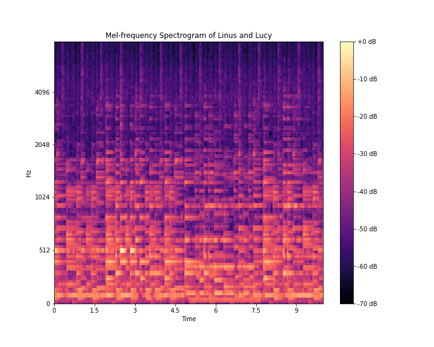

# CNN-Instrument-Classification
Using CNNs to identify instruments in sound files

# The Data
I used google's Audioset metatdata. A file containing video ids of 22,176 youtube videos with a 10 second segment and up two 12 labels of sounds heard on that segment.

## Pipeline for Feature Extraction

1. download audio data from youtube video in metadata
2. convert mp4 to mp3
3. trim down to 10 second clip identified in metadata. Now we have this 10-second snippet of 'Linus and Lucy'
4. Use the librosa library to generate mel-spectrogram
    - explain what mel-spectrogram is
    - Mel(f) = 2596 log(1 + f/700)
    

## Features extracted from mel-spectrogram:
###     - Mel-frequency cepstral coefficients (MFCC)
  
###     - Spectral Centroid
    - A measure of where a spectrum's center of mass is located. This measurement is used to quantify the 'brightness' of a sound.
    
    
###     - Zero Crossing Rate
    

    
###     - Chroma Frequencies
    - Idendifies sounds that fall into distinced pitches. Large amounts of chroma features is a strong indicator for the presence of music.
     
     
    
###     - Spectral Roll-off
    - The frequency below which a certain percentage of the total spectral energy lies.
    
    

