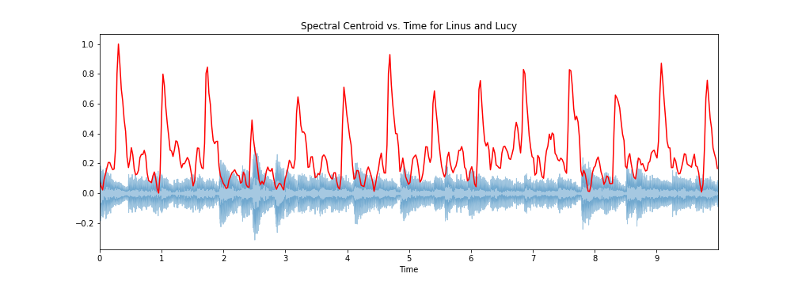
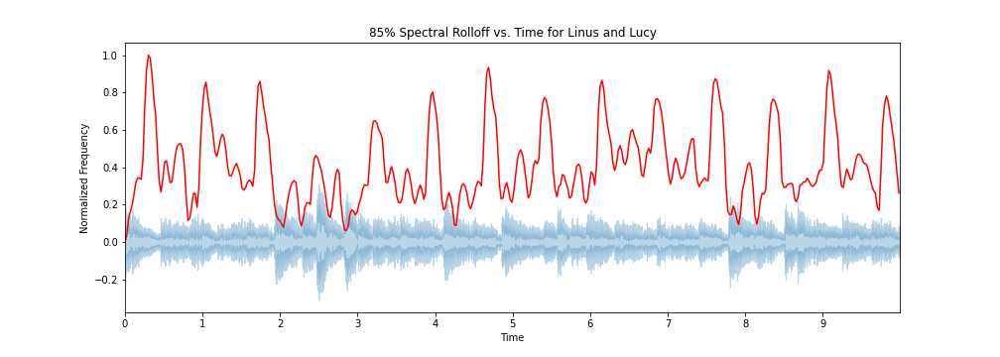

# CNN-Instrument-Classification
Using CNNs to identify instruments in sound files

# The Data
I used google's Audioset metatdata. This metadata contians video ids of 22,176 YouTube videos with a specified 10 second 
segment and at least one label of sound heard on that segment.

### Metatdata
The metadata consits of Youtube video ids 'YTID'

### 'recorded_labels' are linked to this dataframe:

### Labeling Accuracy
Some of the labeled sounds don't actually appear in the video segments. I will cut the data down to the sounds with labeling accuray >= 80%. This corresponds to class lables with a ratio over 0.8.

# Feature Extraction Pipeline

1. Download audio data from youtube videos in the metadata
2. Convert mp4 files to mp3
3. Trim mp3 file down to the 10 seconds indicated in the metadata.
4. Use the librosa library to generate a mel-spectrogram and extract the following features:
    - Mel-frequency cepstral coefficients
    - Spectral Centroid
    - Zero Crossing Rate
    - Chroma Frequencies
    - Spectral Roll-off
5. Append the list of features to the 'Features Dataframe'
    
    
## Let's visualize the feature extraction from a snippet of 'Linus and Lucy'

## Features extracted from mel-spectrogram:
###     Mel-frequency cepstral coefficients (MFCC)
  
###     Spectral Centroid
    - A measure of where a spectrum's center of mass is located. This measurement is used to quantify the 'brightness' of a sound.
  
    
###     Zero Crossing Rate
    - The rate at which the sound wave crosses the x-axis. This feature is important for
        identifying voiced and unvoiced audio signals
  

    
###     Chroma Frequencies
    - Idendifies sounds that fall into distinced pitches. 
    - Large amounts of chroma features is a strong indicator for the presence of music.
   
     
    
###     Spectral Roll-off
    - The frequency below which a certain percentage of the total spectral energy lies. I've used 85% for this model.
   
  
    

## Building the Neural Networks
There are over 500 unique labels in the data. Instead of training a model to recognize all labels concurrently, 
we'll train it to recognize the presence of certain unique sounds. 
Here are two differnt models:

- One that identifies music
- One that identifies speech

For each model, we will train on the five features we extracted, and evaluate on whether or not speech or music was contained in that sample.

An 80-20 train_test_split was used on the data to obtain 635 training data points and 159 testing data points.

## Neural Network Results

Terrible

Here are confusion matrices visualized as a bar charts for speech and music recognition:

It looks like the models were proficient at classifying True Negatives, but its abysmal performance overall 
indicates that this was due to there being more datapoints with label '0'

More data will need to be used to obtain more accurate results on a wider range of sounds.

## Next Steps
 - Scale up the amount of data
 - Train models on equal numbers of class labels '1' and '0'
 - Train models on more classes and integrate together
